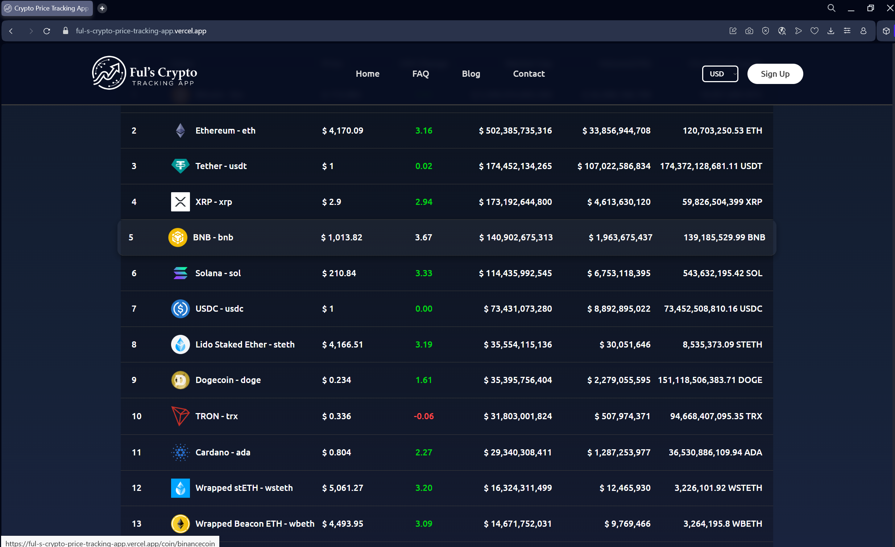
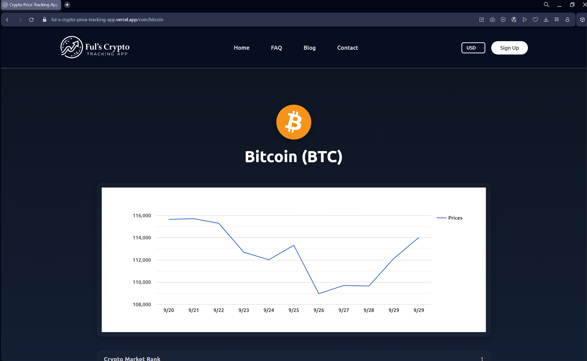

# Ful’s Crypto Tracking App

---
## 📖 Overview
**Live Preview:** [https://ful-s-crypto-price-tracking-app.vercel.app/](https://ful-s-crypto-price-tracking-app.vercel.app/)  

**Ful’s Crypto Tracking App** is a modern web platform for monitoring cryptocurrency prices, market capitalization, and trends in real-time.  
Powered by the **CoinGecko API**, it delivers live data, instant search, and a clean, user-friendly interface—making it easier to stay updated with the crypto market.  

---

## 📸 Screenshots
  
  

  
  
  

---

## ✨ Features
| Feature                | Description                                                                 |
|-------------------------|-----------------------------------------------------------------------------|
| **Crypto Search**   | Quickly find your favorite cryptocurrency by name or symbol.                |
| **Live Price Feed** | Real-time price updates powered by the **CoinGecko API**.                   |
| **Market Insights** | Displays Market Cap, 24h Volume, and Circulating Supply.                    |
| **Real-Time Update**| Stay up-to-date with live 24h price changes.                                |
| **Routing**         | Smooth page navigation using **React Router DOM**.                          |
| **Data Visualization** | Interactive charts and statistics with **React Google Charts** |

---

## 🛠 Tech Stack
### Frontend
- **React (Vite)** – Fast and modern development environment with Hot Module Reload (HMR).  
- **React Router DOM** – Enables seamless client-side routing.  
- **Vanilla CSS** – Elegant, responsive, and minimalistic design.  
- **React Google Charts** – https://www.react-google-charts.com/examples/line-chart – Interactive charts for visualizing crypto data.  

### API
- **CoinGecko API** – https://www.coingecko.com/en/api – Provides real-time cryptocurrency data (price, market cap, volume, etc.).  

---

# React + Vite

This template provides a minimal setup to get React working in Vite with HMR and some ESLint rules.

Currently, two official plugins are available:

- [@vitejs/plugin-react](https://github.com/vitejs/vite-plugin-react/blob/main/packages/plugin-react) uses [Babel](https://babeljs.io/) for Fast Refresh
- [@vitejs/plugin-react-swc](https://github.com/vitejs/vite-plugin-react/blob/main/packages/plugin-react-swc) uses [SWC](https://swc.rs/) for Fast Refresh

## React Compiler

The React Compiler is not enabled on this template. To add it, see [this documentation](https://react.dev/learn/react-compiler/installation).

## Expanding the ESLint configuration

If you are developing a production application, we recommend using TypeScript with type-aware lint rules enabled. Check out the [TS template](https://github.com/vitejs/vite/tree/main/packages/create-vite/template-react-ts) for information on how to integrate TypeScript and [`typescript-eslint`](https://typescript-eslint.io) in your project.
